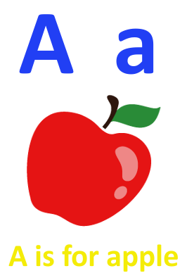

I started writing this little app as a way to help my son learn to associate the keys on a laptop keyboard with the alphabet that he's been learning through songs like the ABC song.  

The idea in a nutshell is that when he pushes a key on the keyboard:
- it will display a card with uppercase and lowercase letters next to each other 
- an image and 
- a description with the form 'a is for apple'.  

After a little research (mainly googling flashcard images :} ) I settled on using the following dimensions for the card:
- 33%: upper and lower case letters
- 51%: image
- 16%: description

Possible data structures that spring to mind are:
- Name: Flashcard
- Description: Holds flashcard info
- Fields: Letter, Image, object

This could use the functionn f(letter, object){ return `${letter} is for ${object}`} to create the description.

Here's an example of the card:  

[back](../README.md)